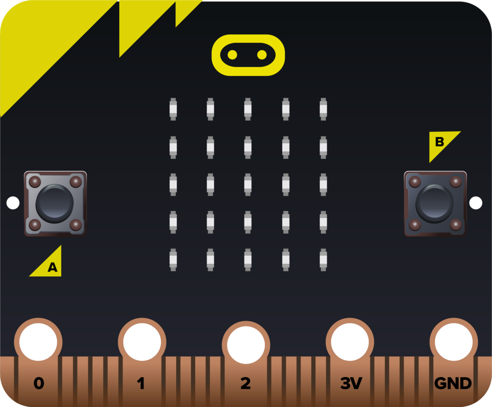
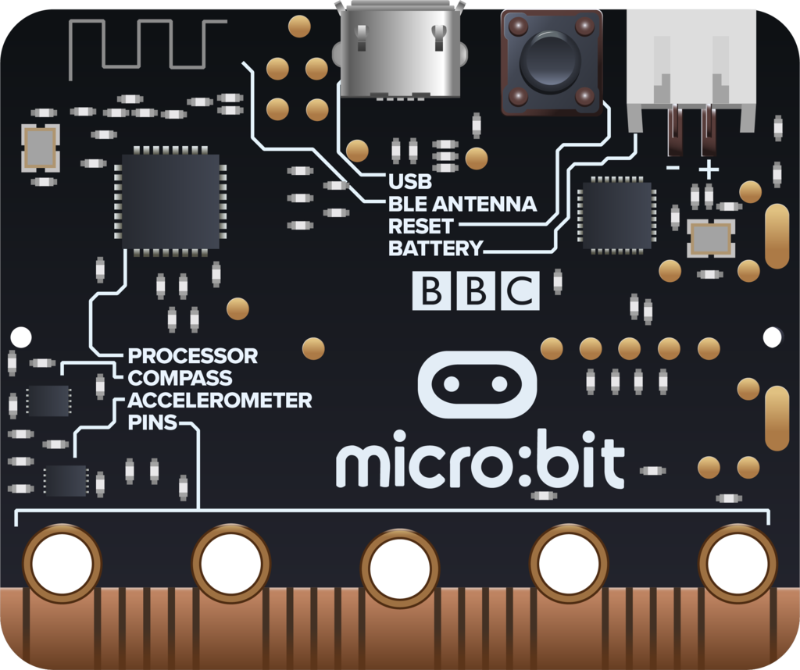
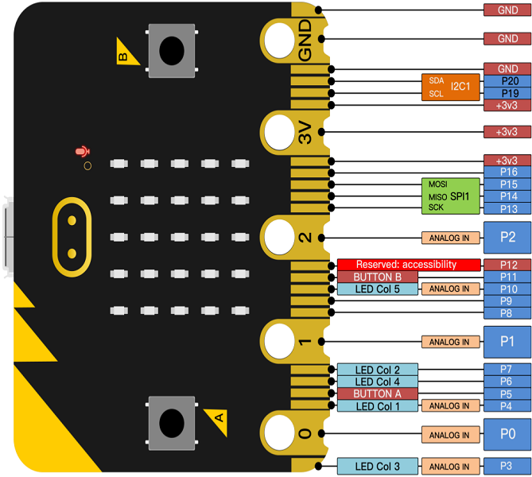
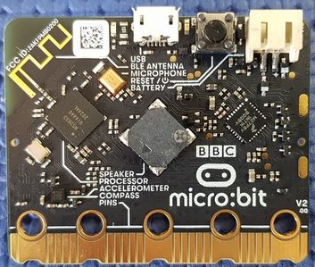
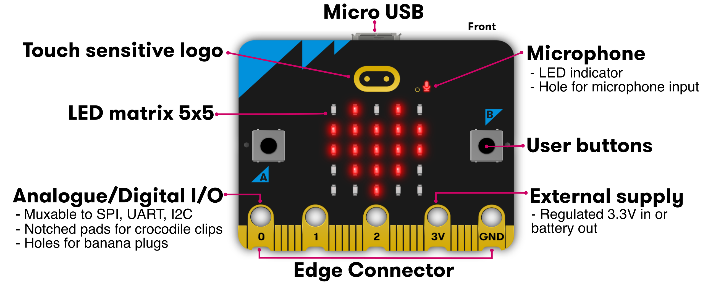
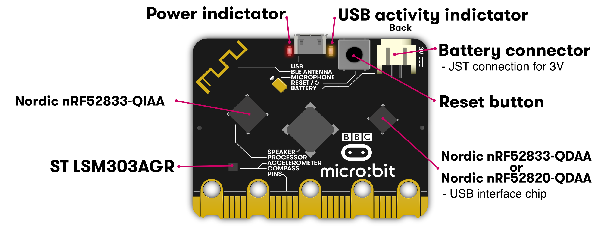

# micro:bit

### Danilo Abbasciano

2 lug 2025

---
### Chi sono?

 - Appassionato di software libero e GNU/Linux dal kernel 2.2
 - Technical Leader e Cloud Architect
 - Passione per i linguaggi di programmazione
 - Convinto sostenitore di Python

---
## Da dove vengo?

### Velletri LUG

LUG è l'acronimo di Linux Users Group: una libera associazione di
utenti Linux che intende promuovere l'utilizzo del sistema operativo
Linux e approfondirne la conoscenza dei propri membri attraverso la
loro mutua collaborazione

---

## Come entrare nel VelletriLUG?


https://t.me/velletrilug

---
### Latina In Tech

Community che riunisce appassionati del macromondo tech di Latina e dintorni.

Obiettivi:
 - favorire la condivisione di conoscenza
 - entrare in contatto con persone con interessi nell'ambito IT

---
### Latina In Tech


---

### Cos'è micro:bit?
 - Un microcontrollore educativo progettato per la didattica
 - Sviluppato dalla **BBC** in collaborazione con altri partner
 - Dotato di sensori, LED e connettività
 - Ideale per scuole, per muovere i primi passi nella programmazione e progetti DIY

---
### versioni
 - micro:bit originale
 - nuovo micro:bit con il suono
---
### micro:bit originale (fronte)
 <!-- .element width="600px" -->

---
### micro:bit originale (retro)

 <!-- .element width="600px" -->

---

### entrambi i micro:bit hanno nella parte anteriore (1/2)

* **dimensione**: 4x5 cm

* **bottoni** 2 bottoni frontali
 
* **display** 25 LED a matrice 5x5 dove è possibile far scorrere i messaggi o visualizzare i numeri;

* **sensori** sensore di luminosità

---
### entrambi i micro:bit hanno nella parte anteriore (2/2)

* **I/O**

   - pin GPIO che permettono la connessione di cuffie, sensori di pressione e altro;
   - pin con una tensione di 3 volt e pin per la messa a terra
   - Connettore a 20 pin lungo la parte inferiore della scheda;

---



--

### entrambi i micro:bit hanno nella parte posteriore (1/2)

* **antenna**
 può cominucare con altri micro:bit o altri dispositivi via bluetooth

* **processore e sensore di temperatura**

* **sensori**
   - Sensore di movimento
   - accelerometro 3D

---
### entrambi i micro:bit hanno nella parte posteriore (2/2)

* **connessioni**
   - Porta USB per connettere il PC, per la programmazione o l’alimentazione 5V;
   - Connettore per una batteria da 3V;
 
* **led**
 Singolo led che lampeggia quando si sta scaricando il programma o è alimentato dalla porta USB

* **bottone di reset**

---
### nuovo micro:bit v2


---
### cosa ha il nuovo micro:bit nella parte anteriore
* **logo**
 il logo funziona come un sensore di pressione, puó essere usato come un ulteriore bottone

* **microfono**
 si possono creare programmi che rispondono a rumori o silenzi, c'è un led che indica quando il microfono è acceso

---

### micro:bit v2 (fronte)


---
### cosa ha il nuovo micro:bit nella parte posteriore (1/2)
* **altoparlante**
rappresentato da un buzzer
 
* **led rosso**
indica che il micro:bit è alimentato dalle batterie o dal cavo USB

* **led giallo**
lampeggia quando il pc comunica con il micro:bit attraverso la USB

---
### cosa ha il nuovo micro:bit nella parte posteriore (2/2)

* **pulsante reset e power**
Premendolo si resetta eseguendo il programma dall'inizio. Se viene
tenuto premuto il led rosso si spegne, a questo punto si può lasciare
il bottone e il micro:bit entra in modalità power-safe (sleep
mode). Premere di nuovo il bottone per risvegliarlo.

---
### micro:bit v2 (retro)



---
## Perché usare micro:bit?
 - Facile da programmare
 - Supporta più linguaggi (MakeCode, Python, JavaScript)
 - Stimola la creatività e il pensiero computazionale
 - Utilizzato in progetti STEM/STEAM

---
## Esempi di progetti
 - **Semplici giochi** (es. dado elettronico)
 - **Controllo di robot**
 - **Stazione meteo** con sensori
 - **Dispositivi IoT** (es. antifurto)

---
## Come iniziare?
 1. Collegare micro:bit al PC via USB
 2. Scrivere il codice
 3. Flasharlo sulla scheda

---
### Come scrivere il codice?

 - [MakeCode](https://makecode.microbit.org/)
   Un editor di codice online a blocchi basato sul Microsoft
   Programming Experience Toolkit (PXT).
   
   L'editor MakeCode ti consente anche di creare estensioni per i tuoi
   accessori preferiti; le estensioni sviluppate dalla community
   possono essere trovate qui:
   https://makecode.microbit.org/extensions/ 

---
### Come scrivere il codice?
 - [Python web editor](http://python.microbit.org/)
   Editor online Python semplice da usare. Il file HEX viene generato
   nel browser e funziona anche offline.
   
   L'editor è stato creato da volontari nel loro tempo libero ed è ora
   gestito dalla Micro:bit Educational Foundation. È un software
   libero, quindi siete liberi di adattarlo, adottarlo e modificarlo
   per i vostri scopi. Accogliamo anche contributi.
   
---
### Come scrivere il codice?
 - **MicroPython** è una reimplementazione completa di Python3 per
 piccoli computer e permette di eseguire script Python sul micro:bit.
 
 MicroPython è stato ampliato per includere uno speciale modulo Python
 per micro:bit e altre funzionalità divertenti come la musica, che
 consentono di programmare facilmente il dispositivo. Il codice è
 stato creato da un team internazionale di sviluppatori di software
 libero e siete invitati a contribuire.
   
---
### Come scrivere il codice?
 - [Mu editor](https://codewith.mu/): Mu è un semplice editor di
   codice per programmatori principianti, basato su un ampio feedback
   da parte di insegnanti e studenti. Mu è scritto in Python e
   funziona su Windows, OSX, Linux e Raspberry Pi. L'editor Mu
   supporta il flashing rapido e l'accesso al
   REPL.

---
### Come scrivere il codice?
 - **Il runtime micro:bit - DAL**

  Il Device Abstraction Layer (DAL) di micro:bit è l'insieme
  principale di driver, meccanismi e tipi che costituiscono il runtime
  di micro:bit.

  Fornisce accesso a tutte le funzionalità di micro:bit tramite una
  libreria C/C++ semplice e intuitiva. È inoltre una piattaforma
  open source completamente documentata che consente lo sviluppo
  diretto di programmi micro:bit

---
### Come scrivere il codice?
 - [MakeCode](https://makecode.microbit.org/)
 - [Python web editor](http://python.microbit.org/)
 - MicroPython
 - [Mu editor](https://codewith.mu/)
 - JavaScript
 - Il runtime micro:bit - DAL

---

### Esempio in Python
example.py
```python
from microbit import *
display.scroll("Ciao, mondo!")
```

Flash Python onto the BBC micro:bit
```bash
$ uflash example.py 
Flashing example.py to: /run/media/piuma/MICROBIT/micropython.hex
```
---

### Risorse utili

 - MakeCode: https://makecode.microbit.org/

 - Python: https://python.microbit.org/v/3
 
 - Sito ufficiale https://microbit.org/

 - Documentazione https://microbit.org/guide/

 - Forum della community https://support.microbit.org/
	
---
# ?

---
# Grazie

Danilo Abbasciano

https://github.com/piuma/talk-microbit

